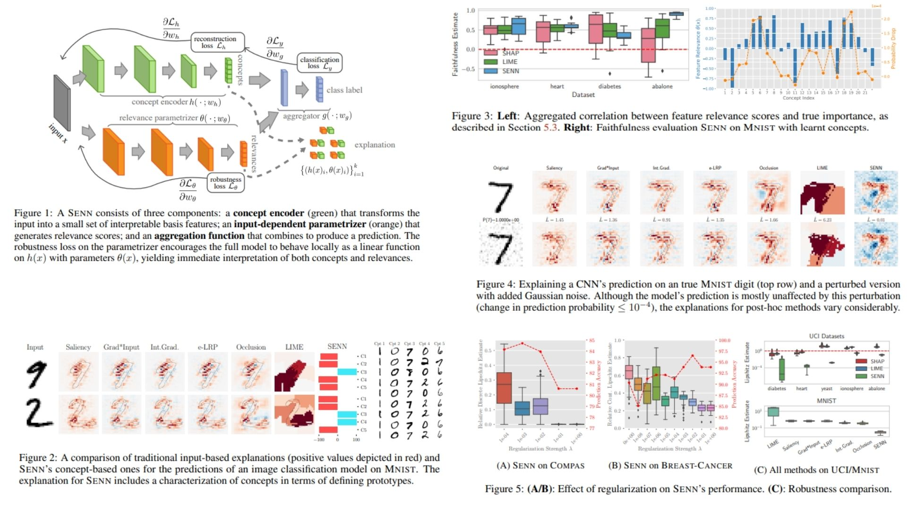

# 🍥 SENN-Replication – Self-Explaining Neural Networks with Intrinsic Interpretability

This repository provides a **PyTorch-based replication** of  
**Self-Explaining Neural Networks – Alvarez-Melis & Jaakkola, NeurIPS 2018**.

The focus is **translating the theoretical SENN framework into a clean, modular, and practical architecture**,  
rather than chasing benchmark SOTA results.

- Learns **interpretable concepts** as internal reasoning units 🧠  
- Produces **intrinsic explanations by design** (not post-hoc) 🪞  
- Enforces **faithfulness and stability via gradient regularization** 🧭  
- Modular & lightweight, **plug-and-play for any encoder backbone** 🛠️  

**Paper reference:** [Towards Robust Interpretability with Self-Explaining Neural Networks – Alvarez-Melis & Jaakkola, 2018](https://arxiv.org/abs/1806.07538) 📄

---

## 🧠 Overview – Self-Explaining Pipeline



The core idea:

> The model must not only predict — it must **explain itself while predicting**.

Instead of learning a black-box mapping  
$x \rightarrow y$,  
the model is structured as:

$$
x \;\longrightarrow\; h(x), \theta(x) \;\longrightarrow\; y
$$

Where:
- $x$ = raw input (image, signal, etc.)
- $h(x)$ = vector of interpretable concepts  
- $\theta(x)$ = relevance scores for each concept  
- $y$ = final prediction  

The prediction is computed as:

$$
f(x) = g(\theta(x) \odot h(x))
$$

This creates a **self-explaining model**:
> Every prediction comes with its own explanation.

---

## 🧮 SENN Computation – Math Essentials

### Concept Encoding (x → h)

Given input $x$ and encoder $E$:

$$
z = E(x), \quad h(x) = C(z)
$$

Where:
- $z \in \mathbb{R}^d$ is latent feature representation  
- $h(x) \in \mathbb{R}^k$ is concept vector  

Each dimension corresponds to one interpretable concept.

### Relevance Parametrization (x → θ)

A second network produces **input-dependent relevance scores**:

$$
\theta(x) = P(z)
$$

Where:
- $\theta(x) \in \mathbb{R}^k$
- Each $\theta_i(x)$ measures how important concept $h_i(x)$ is for this specific input.

### Aggregation (h, θ → y)

Prediction is computed via an additive monotone aggregator:

$$
f(x) = g(\theta(x) \odot h(x)) = \sum_{i=1}^k \theta_i(x) h_i(x)
$$

This preserves interpretability:
- Each concept contributes independently
- No entangled interactions
- Signs and magnitudes remain meaningful

---

## 🧭 Stability Regularization 

SENN enforces that explanations are **not cosmetic**.

The relevance scores $\theta(x)$ must reflect the true sensitivity of the model.

This is enforced by matching:

$$
\nabla_x f(x) \;\approx\; J_h(x) \cdot \theta(x)
$$

Where:
- $\nabla_x f(x)$ = true gradient of the model (real behavior)
- $J_h(x)$ = Jacobian of the concept encoder
- $\theta(x)$ = explanation vector

Stability loss:

$$
\mathcal{L}_{\text{stability}} = \left\| \nabla_x f(x) - J_h(x)\theta(x) \right\|^2
$$

This acts as a **truth constraint**:
> The explanation must match the model’s actual reasoning.

---

## 🧠 What the Model Enables

- Intrinsic explanations (not post-hoc)
- Local linear reasoning with adaptive coefficients
- Faithful concept attribution
- Stability across similar inputs
- Transparent decision pathways
- Human-readable model behavior

The model is **interpretable by construction**.

---

## 📦 Repository Structure

```bash
SENN-Replication/
├── src/
│   ├── backbone/
│   │   └── encoder.py          # Input → latent feature extractor
│   │
│   ├── concepts/
│   │   └── concept_encoder.py  # h(x): latent → concept vector
│   │
│   ├── relevance/
│   │   └── parametrizer.py     # θ(x): latent → relevance scores
│   │
│   ├── aggregator/
│   │   └── aggregator.py       # g(θ ⊙ h) → prediction
│   │
│   ├── model/
│   │   └── senn.py             # Full x → h,θ → y + explanation
│   │
│   ├── loss/
│   │   └── senn_loss.py        # Prediction + stability + concept loss
│   │
│   ├── explanation/
│   │   └── explain.py         # Explanation extraction
│   │
│   └── config.py
│
├── images/
│   └── figmix.jpg             # SENN overview figure
│
├── requirements.txt
└── README.md
```
---


## 🔗 Feedback

For questions or feedback, contact: [barkin.adiguzel@gmail.com](mailto:barkin.adiguzel@gmail.com)
